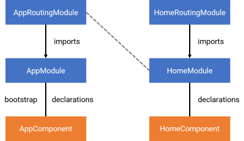

# Estrutura do software

A [versão 3](adotapet-v3.md) já entrega um software razoavelmente utilizável. Já conseguimos ver também como utilizar alguns dos vários compoentes do NativeScript. Agora, antes de prosseguir, falta entender um pouco mais da arquitetura do Angular para compreender melhor a estrutura do software.

Em [estrutura do projeto](estrutura-do-projeto.md) vimos um pouco sobre elementos da arquitetura do Angular, principalmente módulos, módulos de rotas e componentes.

A figura a seguir ilustra essa arquitetura.



O arquivo `app/app.module.ts` contém a classe `AppModule`, que é o módulo raiz:

```typescript
@NgModule({
    bootstrap: [
        AppComponent
    ],
    imports: [
        NativeScriptModule,
        AppRoutingModule
    ],
    declarations: [
        AppComponent
    ],
    schemas: [
        NO_ERRORS_SCHEMA
    ]
})
export class AppModule { }
```

O que indica que o `AppModule` é o módulo raiz é o arquivo `app/main.ts`:

```typescript
import { AppModule } from "./app.module";
platformNativeScriptDynamic().bootstrapModule(AppModule);
```

Ou seja, a chamada do método `bootstrapModule()` é responsável por isso.

O `AppModule` importa o `AppRoutingModule` (um módulo de rotas) e declara o `AppComponent` (veja os atributos do objeto indicado na chamada de `@NgModule`). O `AppComponent` também é indicado como o primeiro componente a ser executado, ou seja, é o `bootstrap`.

O `AppRoutingModule` contém o código para declarar as rotas (veremos mais sobre isso depois).

O template do `AppComponent` contém:

```html
<page-router-outlet></page-router-outlet>
```

Isso faz com que demais componentes (como o `HomeComponent`) sejam apresentados nesse local.

O `HomeModule` importa o `HomeRoutingModule` e declara o `HomeComponent`. O que faz com que o `HomeComponent` seja carregado é o conteúdo do `HomeRoutingModule`, ou seja, as rotas definidas nele.

Até a [versão 3](adotapet-v3.md) está usando uma técnica de esconder e mostrar componentes para simular a apresentação de telas. Embora isso funcione, não é a melhor prática. Vamos melhorar isso utilizando o recurso de rotas.

Antes, a próxima versão vai utilizar outro recurso da arquitetura do Angular: **services**.
