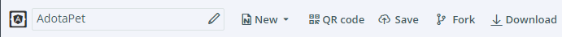
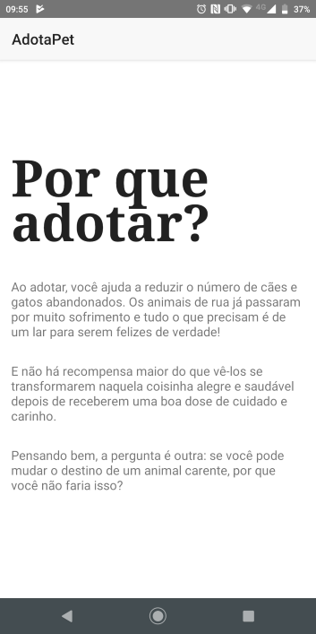

# Versão 1

> Se quiser acompanhar o código completo desta versão acesse https://play.nativescript.org/?template=play-ng&id=4zfO6B&v=2

Vamos iniciar o desenvolvimento do **AdotaPet** pelo requisito:

* Como usuário eu quero ver a tela inicial do aplicativo

Observe a barra de ferramentas do *Playground*:



As ações são:

* nomear/renomear o projeto
* criar novo projeto
* exibir o QR code
* salvar
* fazer fork
* download

**Crie um projeto e conecte seu dispositivo.**

É importante dar um nome para o projeto e também salvá-lo. Para isso você precisa estar logado.

## Implementando a tela inicial

Para implementar o requisito desta versão vamos utilizar a maior parte do conteúdo do projeto padrão -- também para você ir se acostumando aos poucos com a estrutura do software e com os recursos do NativeScript.

O arquivo `app/home/home.component.html` contém o template do componente `HomeComponent`. Por padrão ele usa componentes do NativeScript:

* **ActionBar**: representa a barra no topo do aplicativo
* **GridLayout**: representa um dos recursos de *layout* e é usado para dividir a interface em linhas e colunas, como você faria em uma tabela
* **ScrollView**: torna o conteúdo interno passível de rolagem
* **StackLayout**: outro recurso de *layout* que é usado para empilhar os componentes internos vertical ou horizontalmente
* **Label**: fornece um rótulo de texto na forma somente leitura

Comece modificando o atributo `title` do `ActionBar` para `AdotaPet`.

Vamos substituir o conteúdo do StackLayout para que tenhamos algo como o seguinte:

* um cabeçalho "Por que adotar?"
* um texto "Ao adotar, você ajuda a reduzir o número de cães e gatos abandonados. Os animais de rua já passaram por muito sofrimento e tudo o que precisam é de um lar para serem felizes de verdade!"
* um texto "E não há recompensa maior do que vê-los se transformarem naquela coisinha alegre e saudável depois de receberem uma boa dose de cuidado e carinho."
* um texto "Pensando bem, a pergunta é outra: se você pode mudar o destino de um animal carente, por que você não faria isso?"

Ao usar o componente `Label` use também o atributo `textWrap` com valor `true`.

## Melhorando a aparência 

O projeto padrão traz algum conteúdo no arquivo `app/home/home.component.css`. Vamos usar esse arquivo para melhorar a aparência da tela inicial do aplicativo.

Para deixar os textos da tela um pouco mais espaçados entre si, adicione o seguinte:

```css
Label {
    margin-bottom: 30;
}
```

Isso faz com que todo componente `Label` tenha uma margem inferior de 30 pixels (propriedade `margin-bottom`). Estamos usando um **seletor de elemento** (o seletor é o nome do elemento/componente no template).

Na sequência, crie regras para a classe `h1`:

```css
.h1 {
    font-size: 80;
    font-weight: bold;
    line-height: -20;
    font-family: 'Times New Roman', Times, serif;
}
```

Aqui estamos usando um **seletor de classe** (veja que ele começa com ponto). As regras definem o tamanho da fonte (`font-size`), que a fonte está em negrito (`font-weight`), a altura da linha (`line-height`) e a fonte do texto (`font-family`).

No primeiro `Label` use o atributo `class` com o valor `h1`.

O resultado deve ser semelhante ao seguinte:



A lista de todas as propriedades CSS suportadas no NativeScript pode ser encontrada na documentação oficial: https://docs.nativescript.org/angular/ui/styling#supported-css-properties.