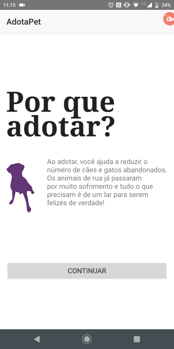

# Versão 2

> Se quiser acompanhar o código completo dessa versão acesse https://play.nativescript.org/?template=play-ng&id=4zfO6B&v=3

A [versão 1](adotapet-v1.md) apresenta a tela inicial com alguns textos que ajudam a motivar pessoas a adotarem bichinhos de estimação. Entretanto, parece muito texto para uma tela. Vamos melhorar isso com mais um requisito:

* como usuário eu quero ver a tela inicial com textos que ajudem no envolvimento com a adoção de animais e use botões para navegar de um texto para o próximo

Para conseguir isso vamos utilizar o componente `Button` e recursos do Angular para template.

## Simulando navegação de tela com lógica de mostrar/ocultar

Uma maneira simples de simular a navegação de tela (de uma tela atual, partir para a próxima tela) é utilizar a lógica de modificar a visibilidade de um elemento no template. 

Para implementar essa lógica adicione um elemento `Button`. Para fazer isso você pode usar o painel **Components** à esquerda da tela do Playground e arrastar o componente para o editor, depois do último `Label`; ele já vai criar um código básico.

Altere o atributo `text` para `Continuar`. Perceba que o elemento contém `(tap)="onButtonTap()"`. Essa sintaxe é chamada de **event binding**. A sintaxe tem, dentro dos parênteses, o nome do evento. O valor do atributo é um código que será executado quando o evento for disparado. Nesse caso, o código chama o método `onButtonTap()`. Para continuar a implementação, vamos para o arquivo `app/home/home.component.ts`, o **controller**.

O controller contém a classe `HomeComponent`, que também, como o template, faz parte do componente. Nessa classe, adicione o atributo `tela`.

```typescript
tela = 'passo1';
```

Modifique o método `onButtonTap()` para o seguinte:

```typescript
onButtonTap(): void {
    if (this.tela == 'passo1') {
        this.tela = 'passo2';
    } else if (this.tela == 'passo2') {
        this.tela = 'passo3';
    } else if (this.tela == 'passo3') {
        this.tela = 'passo4';
    }
}
```

O método utiliza condicionais para modificar o valor do atributo `tela` conforme seu valor atual:

* se a tela atual for **passo1**, então a próxima tela deve ser **passo2**
* se a tela atual for **passo2**, então a próxima tela deve ser **passo3**
* se a tela atual for **passo3**, então a próxima tela deve ser **passo4**

Vamos voltar ao template para continuar a implementação.

No `Label` que apresenta o primeiro texto acrescente o atributo `*ngIf`:

```html
*ngIf="tela == 'passo1'"
```

O atributo representa uma **diretiva estrutural** do Angular e serve para modificar a presença (ou a visibilidade) de um elemento conforme uma expressão lógica. A expressão lógica, nesse caso, é `tela == 'passo1'`, que tem o valor `true`, se o atributo `tela` tiver valor `passo1` ou `false`, caso contrário.

Use essa mesma diretiva e modifique os demais elementos `Label` e veja o resultado:


## Adicionando imagens e usando layouts

Vamos deixar a tela mais agradável visualmente utilizando figuras ao lado dos textos. Para isso, crie a pasta `assets` dentro de `app`.

Faça o download dos seguintes arquivos:

* https://www.amigonaosecompra.com.br/assets/dog-purple1-8bcf39f3ae58cfec05b3a01a3e566b2daa690308bcb5ea521d31676b308381e5.png
* https://www.amigonaosecompra.com.br/assets/cat-purple1-5d05d0c1b490a07b7856e8859d76265da10e5ddeb7654667dace3f4dbfeab292.png
* https://www.amigonaosecompra.com.br/assets/dog-purple2-cecd03f23001be6268ef8fb276d518e7a0b837ac07769fa5754b294c97d691ff.png

Salve cada arquivo na pasta `assets` (dê um nome mais significativo).

Vamos usar o componente `Image` no template para adicionar uma imagem na tela. Antes do primeiro texto (do `Label`), adicione:

```html
<Image src="~/assets/dog1.png"></Image>
```

Estou considerando que existe o arquivo `app/assets/dog1.png`. Veja que o atributo `src` tem o valor `~/assets/dog1.png`. Substituir `app` por `~` significa indicar que o arquivo está na raiz do aplicativo.

A coisa não está muito legal. A imagem está bem pequena e não está posicionada junto ao texto de uma muito agradável, não é? Vamos melhorar isso usando o `GridLayout`:

```html
<GridLayout columns="100, *" *ngIf="tela == 'passo1'">
	<Image src="~/assets/dog1.png" col="0"></Image>
	<Label textWrap="true" col="1"
		text="Ao adotar, ... de verdade!">
	</Label>
</GridLayout>
```

Os elementos `Image` e `Label` estão dentro do `GridLayout`. O atributo `columns` com valor `100, *` significa:

* crie duas colunas
* a primeira coluna tem largura 100
* a segunda coluna usa o restante da área visível como largura

Além disso, a diretiva `*ngIf` foi aplicada no `GridLayout`, ao invés do `Label`.

Tanto o `Image` quanto o `Label` precisam ser posicionados dentro do `GridLayout`. Como ele tem duas duas colunas, especificamos em qual coluna cada componente deve ficar usando o atributo `col` (perceba o valor desse atributo em cada componente). 

Para finalizar, adicione uma margem lateral aos elementos `Image`. No arquivo CSS do `HomeComponente` adicione o seguinte:

```css
Image {
    margin-right: 30;
}
```

O resultado é semelhante ao que ilustra a figura a seguir.



Você encontra mais sobre layouts e componentes do NativeScript na documentação oficial: 

* **layouts**: https://docs.nativescript.org/ui/layouts/layout-containers
* **componentes**: https://docs.nativescript.org/ui/overview

