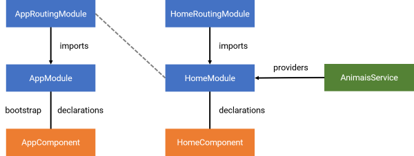

# Versão 4

> Você pode acompanhar o código completo dessa versão acessando https://play.nativescript.org/?template=play-ng&id=4zfO6B&v=5

Esta versão do software tem um requisito não funcional:

* a arquitetura do software deve adotar o recurso de service para isolar comportamento do componente

## Services

Para implementar esse recurso vamos utilizar o conceito de **service** do Angular e criar o arquivo `app/home/animais.service.ts`:

```typescript
import { Injectable } from "@angular/core";

@Injectable()
export class AnimaisService {
    animais = [
        {
            id: 1,
            nome: 'Filhotes',
            foto: 'https://...jpg',
            cidade: 'São Paulo',
            estado: 'SP',
            especie: 'gato',
            sexo: 'F',
            porte: 'P'
        },
        {
            id: 2,
            nome: 'Star',
            foto: 'https://...jpg',
            cidade: 'Rio de Janeiro',
            estado: 'RJ',
            especie: 'cachorro',
            sexo: 'F',
            porte: 'M'
        },
    ];

    lista() {
        return this.animais;
    }
}
```

O arquivo contém a classe `AnimaisService`, que usa a anotação `@Injectable()`. Essa anotação indica que a classe é um serviço.

A classe contém o atributo `animais` (o array de objetos que representam os animais disponíveis para adoção e que antes estava no `HomeComponent`) e o método `lista()`, que retorna esse array.

## Provendo o serviço no módulo

O módulo `HomeModule` precisa prover o serviço. Isso significa que todos os componentes internos do módulo poderão utilizar o serviço. Fazemos isso modificando a anotação da classe `HomeModule` (arquivo `app/home/home.module.ts`):

```typescript
...
import { AnimaisService } from './animais.service';

@NgModule({
    imports: [
        ...
    ],
    ...
    providers: [ AnimaisService ]
})
export class HomeModule { }
```

## Usando o serviço 

Para usar o serviço `AnimaisService` no `HomeComponent` precisamos do recurso **injeção de dependência** (DI, do inglês *dependency injection*). Esse é um recurso de engenharia de software que realiza a integração entre dois elementos do software (no caso, um componente e um serviço). Na prática, a implementação desse recurso requer uma modificação no `constructor()` do `HomeComponent`:

```typescript
constructor(private db: AnimaisService) {
}
```

Essa sintaxe do TypeScript faz com que a classe tenha um atributo privado chamado `db`, do tipo `AnimaisService`. A **injeção de dependência** faz com que o objeto esteja disponível para uso (instanciado). Isso acontece no método `ngOnInit()`:

```typescript
ngOnInit(): void {
    this.animais = this.db.lista();
}
```

Ou seja, o atributo `animais` recebe o retorno do método `lista()`.

O mais importante até aqui é que a mudança na arquitetura do software não modifica seu comportamento.

Por falar em arquitetura, a figura a seguir ilustra a atualização da [versão 4](adotapet-v4.md).



Vamos usar mais recursos da arquitetura do Angular na próxima versão para melhorar ainda mais a estrutura do software.
