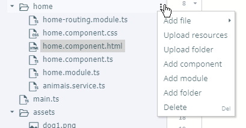
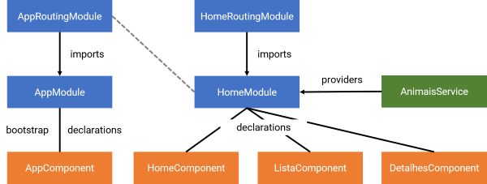

# Versão 5

> Acompanhe o código completo dessa versão acessando https://play.nativescript.org/?template=play-ng&id=4zfO6B&v=5

Nesta versão vamos implementar mais um requisito não funcional:

* a estrutura do software deve adotar três componentes: a) home, para mostrar a tela inicial; b) lista, para mostrar a lista dos animais disponíveis para adoção; e c) detalhes, para mostrar mais informações de um animal.

## Componente Lista

Para implementar esse requisito precisamos adicionar componentes ao software. Para fazer isso, pressione o menu *kebab* da pasta `app/home` e escolha *Add component*:



Na janela que aparece informe `lista.component` para *Component name*. O Playground vai criar três arquivos para o `ListaComponent`:

* `app/home/lista.component.css`
* `app/home/lista.component.html`
* `app/home/lista.component.ts`

Vamos mover parte do código do `HomeComponent` da [versão 4](adotapet-v4.md) para este componente, começando pelo controller, que vai ficar assim:

```typescript
import { Component, OnInit } from "@angular/core";
import { AnimaisService } from './animais.service';

@Component({
	selector: "Lista",
	moduleId: module.id,
	templateUrl: "./lista.component.html",
	styleUrls: ['./lista.component.css']
})
export class ListaComponent implements OnInit {
	animais = null;
	animal = null;

	constructor(private db: AnimaisService) {
	}

	ngOnInit(): void {
		this.animais = this.db.lista();
	}

	onItemTap(args): void {
		this.animal = this.animais[args.index];
	}
}
```

A anotação `@Component()` tem um atributo `selector`, com valor `Lista`. Esse valor indica que vamos inserir esse componente no `HomeComponent` na forma de um elemento (com nome `Lista`).

Da mesma forma, retire parte do template do `HomeComponent` e inclua no template do `ListaComponent`:

```html
<StackLayout class="lista">
    <Label textWrap="true" text="Encontre um peludo para chamar de seu"
        class="h2">
    </Label>
    <ListView class="list-group" [items]="animais"
        (itemTap)="onItemTap($event)" style="height:1250px">
        ...
    </ListView>
</StackLayout>
```

> Também há recursos do CSS que devem estar no `ListaComponent`, mas, por brevidade, não vou citá-los aqui. Veja a versão completa dessa versão.

Antes de usar o componente precisamos modificar o módulo `HomeModule` para que ele declare o componente `ListaComponent`:

```typescript
...
import { ListaComponent } from "./lista.component";

@NgModule({
    imports: [
    ...
    ],
    declarations: [
        HomeComponent, ListaComponent
    ],
    ...
    providers: [AnimaisService]
})
export class HomeModule { }
```

Agora podemos modificar o template do `HomeComponent`. Vai ficar mais ou menos assim:

```html
...
<StackLayout class="home-panel">
    <Label textWrap="true" text="Por que adotar?" class="h1"></Label>
...
</StackLayout>
<Lista *ngIf="tela == 'passo4'"></Lista>
...
```

Ou seja, substituímos o `StackLayout` anterior por `Lista` (mantendo a mesma diretiva `*ngIf`, por sinal).

O software ainda não funciona porque há código no `HomeComponent` referente à apresentação de mais informações de um animal. Vamos melhorar isso criando mais um componente.

## Componente Detalhes

Crie o componente `DetalhesComponent` da mesma forma como criou o `ListaComponent`. O Playground vai criar os arquivos do componente. Modifique o módulo `HomeModule` para que ele declare o componente.

Mova parte do template do `HomeComponent` para o `DetalhesComponente`, de forma que ele fique assim:

```html
<StackLayout class="detalhes">
    <Label textWrap="true" [text]="animal.nome" class="h2"></Label>
    <Image [src]="animal.foto" verticalAlignment="center" stretch="aspectFill"></Image>
    <Label textWrap="true" [text]="animal.cidade + '/' + animal.estado"
        padding="20">
    </Label>
    <GridLayout columns="auto, *" padding="20">
        <StackLayout orientation="horizontal" col="0">
            <Label text="P" class="animal-porte"
                [class.porte-ativo]="animal.porte == 'P'">
            </Label>
            <Label text="M" class="animal-porte"
                [class.porte-ativo]="animal.porte == 'M'">
            </Label>
            <Label text="G" class="animal-porte"
                [class.porte-ativo]="animal.porte == 'G'">
            </Label>
        </StackLayout>
        <Label horizontalAlignment="right" class="animal-sexo" col="1"
            [text]="animal.sexo" [class.sexo-f]="animal.sexo == 'F'"
            [class.sexo-m]="animal.sexo == 'M'">
        </Label>
    </GridLayout>
</StackLayout>
```

No controller do `DetalhesComponent` temos uma pequena alteração:

```typescript
import { Component, OnInit, Input } from "@angular/core";

@Component({
	selector: "Detalhes",
	moduleId: module.id,
	templateUrl: "./detalhes.component.html",
	styleUrls: ['./detalhes.component.css']
})
export class DetalhesComponent implements OnInit {
	@Input() animal = null;

	constructor() {
	}

	ngOnInit(): void {
	}
}
```

Veja que o atributo `selector` indica o nome do elemento quando formos usar o componente.

A classe declara o atributo `animal` e há a anotação `@Input()`. Isso faz com que o componente precise de uma entrada para funcionar. Faremos isso logo em seguida.

## Usando o componente Detalhes no Lista

Modifique o template do `ListaComponent` para que ele fique mais ou menos com essa estrutura:

```html
<StackLayout class="lista" *ngIf="!animal">
    <Label textWrap="true" text="Encontre um peludo para chamar de seu"
        class="h2">
    </Label>
    <ListView class="list-group" [items]="animais"
        (itemTap)="onItemTap($event)" style="height:1250px">
...
    </ListView>
</StackLayout>
<Detalhes [animal]="animal" *ngIf="animal"></Detalhes>
```

Usamos a diretiva `*ngIf` para que o `StackLayout` só esteja visível se o atributo `animal` for `null`. 

Logo abaixo do `StackLayout` temos o `Detalhes`. Perceba que o atributo `animal` está vinculado ao atributo `animal` do controller. É assim que fazemos com que o componente `DetalhesComponent` receba uma entrada: o objeto `animal` que será apresentado. Além disso, só exibimos o componente se `animal` não for `null`.

## Mudanças na arquitetura

Ao final dessa versão temos o software funcionando da mesma forma, mas com uma arquitetura diferente, como ilustra a figura a seguir.



A figura mostra que a arquitetura do software tem vários elementos e está escalando de forma apropriada, o que ajuda a demonstrar a utilidade do Angular em projetos de qualquer tamanho.

Entretanto, ainda há bastante para melhorar a implementação do software. A próxima versão vai utilizar o conceito de rotas para melhorar a implementação da mudança de telas (navegação).
