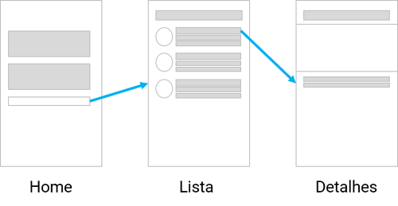
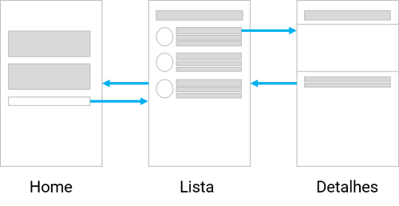

# Versão 6

> Você pode acompanhar o código completo acessando https://play.nativescript.org/?template=play-ng&id=4zfO6B&v=8

Nesta versão vamos implementar o requisito não-funcional:

* o recurso de navegação de telas deve ser obtido utilizando rotas

Para implementar esse requisito primeiro precisamos entender o conceito de rota.

## Navegação

Na web usamos a URL (*Uniform Resource Locator*) para representar endereços de recursos (páginas, imagens etc.). 

No mobile o recurso de URL também está disponível, principalmente para pemitir ações ou *intents* (exemplo: abrir o *Preview* depois que você rastreia o QR code no *Playground*).

Nesse sentido, a principal diferença entre os ambientes web e mobile é que no primeiro a URL fica visível e representa uma forma de comunicação e acesso a conteúdos, enquanto no mobile o seu uso fica restrito ao próprio sistema operacional e aos aplicativos.

No cenário de um aplicativo as URLs são muito práticas para permitir a navegação entre telas, como ilutstra a figura a seguir.



A figura mostra três telas: **Home**, **Lista** e **Detalhes**. A navegação é demonstrada pelas setas azuis: 

* na tela Home, o clique do botão navega para a tela Lista
* na tela Lista, o clique em um item da lista navega para a tela Detalhes

Além disso, da mesma forma como no browser, navegação entre telas pode ser controlada por botões do sistema, se disponível, para, por exemplo, voltar para a tela anterior.

## Rotas

A navegação está disponível no Angular por meio do recurso **rotas**. Rotas são definidas em módulos de rotas por meio de um array de objetos que possuem os atributos:

* `path`: o caminho da rota
* `component`: indica qual componente está associado à rota

Assim, por exemplo, considere que a rota com caminho `home` esteja associada ao componente `HomeComponent`, enquanto a rota com o caminho `lista` esteja associada ao componente `ListaComponent`. Isso permite que, a partir do `HomeComponent` seja possível navegar para o `ListaComponent`.

Na prática esse recurso é uma alternativa à técnica de ocultar e mostrar da [versão 5](adotapet-v5.md).

## Rotas no módulo Home

O módulo de rotas `HomeRoutingModule`, presente no arquivo `app/home/home-routing.module.ts` contém as rotas do módulo `Home`. Nesse arquivo uma variável `routes` contém um array com os objetos que representam as rotas (contendo a estrutura mencionada anteriormente). Modifique o código desse arquivo para refletir o seguinte:

```typescript
...
import { ListaComponent } from './lista.component';
import { DetalhesComponent } from './detalhes.component';

const routes: Routes = [
    { path: "lista", component: ListaComponent },
    { path: "detalhes/:id", component: DetalhesComponent },
    { path: "", component: HomeComponent }
];
...
```

O código declara três rotas, nessa ordem:

* rota com caminho `'lista'` associado ao componente `ListaComponent`
* rota com caminho `'detalhes/:id'`, associado ao componente `DetalhesComponent`
* rota com caminho `''` associado ao componente `HomeComponent`

## Rotas no módulo App

Preferi apresentar as rotas do módulo Home primeiro, mas o módulo App também tem suas rotas, embore use uma estrutura um pouco diferente (por isso deixei para depois).

O arquivo `app/app-routing.module.ts` contém o `AppRoutingModule`  (o módulo de rotas raiz). A variávei `routes` dele contém:

```typescript
const routes: Routes = [
    { 
        path: "", 
        redirectTo: "/home", 
        pathMatch: "full" 
    },
    { 
        path: "home", 
        loadChildren: () => import("./home/home.module").then(m => m.HomeModule) 
    }
];
```

Há duas rotas aqui:

* rota com caminho `''` usa o atributo `redirectTo` para redireciona para a rota com o caminho `/home` (a rota seguinte)
* rota com caminho `'home'` contém o atributo `loadChildren`, que representa uma função que permite carregar o módulo Home utilizando uma técnica chamada de **lazy loading**

As rotas estão associadas a URLs conforme o módulo em que estão definidas. As rotas do módulo App:

* rota com caminho `''` está associada à URL `/` (raiz)
* rota com caminho `'home'` está associada à URL `/home`

As rotas do módulo Home têm o prefixo `home` (por causa da forma como o módulo é carregado no módulo App):

* rota com caminho `'lista'` está associada à URL '/home/lista`
* rota com caminho `'detalhes/:id'` está associada à URL `/home/detalhes`
* rota com caminho `''` está associada à URL `/home`

O Angular combina essas rotas para identificar corretamente qual componente deve ser carregado.

## Navegar é preciso!

Começaremos o uso de rotas pelo componente `HomeComponent`. Modifique-o para que pareça com o seguinte:

```typescript
...
import { Router } from '@angular/router';

@Component({
...
})
export class HomeComponent implements OnInit {
    tela = 'passo1';

    constructor(private router: Router) {
    }

    onButtonTap(): void {
        if (this.tela == 'passo1') {
            this.tela = 'passo2';
        } else if (this.tela == 'passo2') {
            this.tela = 'passo3';
        } else if (this.tela == 'passo3') {
            this.router.navigate(['/', 'home', 'lista']);
        }
    }
...
}
```

Vamos por partes. Primeiro o código importa o serviço `Router` (do pacote `@angular/router`). Na sequência, injeta esse serviço por meio do `constructor()` criando o atributo `router`.

Por fim, observe a modificação no método `onButtonTap()`: quando o atributo `tela` tiver valor `passo3` significa que queremos navegar para o componente `ListaComponent`. Fazemos isso usando o método `navigate()`. O parâmetro desse método é um array com três elementos: `/`, `home` e `lista`. O serviço `Router` faz uma composição desses elementos para que a navegação seja feita para a URL `/home/lista`.

## Rotas com parâmetros

É comum uma URL conter parâmetros. Você já deve ter encontrado algum site em com uma URL mais ou menos assim `/noticias?id=150`. O que está depois do símbolo `?` é chamado parâmero de URL (nesse caso há o parâmetro `id`, com valor `150`).

No caso de rotas temos algo semelhante. Observe mais uma vez as rotas do `AppRoutingModule`, em especial a associada ao `DetalhesComponent`:

```typescript
...
import { ListaComponent } from './lista.component';
import { DetalhesComponent } from './detalhes.component';

const routes: Routes = [
    { path: "lista", component: ListaComponent },
    { path: "detalhes/:id", component: DetalhesComponent },
    { path: "", component: HomeComponent }
];
...
```

O caminho é `detalhes/:id`. Essa sintaxe com o símbolo `:` seguido por um nome representa parâmetros de rota. Nesse caso temos um parâmetro chamado `id`. Vamos modificar o `ListaComponent` para usar esse recurso.

Importe o serviço `Router`:

```typescript
import { Router } from '@angular/router';
```

Modifique o `constructor()` para injetar o serviço `Router` e altere o método `onItemTap()` para o seguinte:

```typescript
constructor(private db: AnimaisService, private router: Router) {
}

onItemTap(args): void {
    this.animal = this.animais[args.index];
    this.router.navigate(['/', 'home', 'detalhes', this.animal.id]);
}
```

O código do método `onItemTap()` usa o método `navigate()` para navegar para a tela `DetalhesComponent` fornecendo o identificador do animal que será apresentado no componente. Para isso, os elementos do array são: `/`, `home`, `detalhes` e `this.animal.id`. Por exemplo, quando for um animal com identificador 5, a URL será `/home/detalhes/5`. O número 5 é associado ao parâmetro de rota `id` e, com isso, conseguimos modificar o componente `DetalhesComponent` para obter essa informação e apresentar as informações do animal correto. 

Antes de alterar o `DetalhesComponent` é necessária uma última alteração no template do `ListaComponent`:

* remova a diretiva `*ngIf` do elemento `StackLayout`
* remova o elemento `Detalhes` 

No controller do componente `DetalhesComponent`, acrescente as duas importações a seguir:

```typescript
import { ActivatedRoute } from '@angular/router';
import { AnimaisService } from './animais.service';
```

Modifique o atributo `animal`, removendo a anotação `@Input()` (o componente não usa mais essa abordagem).

O serviço `ActivatedRoute` permite obter informações da rota atual, como o valor de um parâmetro de rota. Na sequência, injete os serviços no `constructor()`:

```typescript
constructor(
    private db: AnimaisService, 
    private route: ActivatedRoute) {
}
```

Por fim, altere o método `ngOnInit()`:

```typescript
ngOnInit(): void {
    let id = parseInt(this.route.snapshot.paramMap.get('id'));
    this.animal = this.db.lista().find(a => a.id == id);
}
```

Para obter o valor do parâmetro de rota `id` o código usa   `route.snapshot.paramMap.get('id')` e o converte para número usando a função `parseInt()`. O identificador é atribuído à variável `id`. Na sequência, o código usa o serviço `AnimaisService` para encontrar o animal com o identificador.

> **Métodos de `Array`**
> 
> Métodos de `Array` são muito utilizados em programação TypeScript. No trecho de código anterior está sendo utilizado o método `find()`, que permite encontrar um elemento do array usando uma **função seta** (do inglês *arrow function*). 

## Melhorias na navegação

Ao adotar o recurso de rotas conseguimos não apenas navegar de uma tela para a próxima, mas também usar o recurso de "voltar" do dispositivo para voltar para a tela anterior. Com isso, conseguimos melhorar a navegação do app, como ilustra a figura a seguir.



A figura ilustra que agora é possível navegar de volta de uma tela para outra, tornando mais agradável a experiência de uso do app.

O resultado é mais ou menos o seguinte:


A documentação do NativeScript apresenta mais detalhes sobre recursos e padrões de navegação usando Angular. Leia: https://docs.nativescript.org/angular/core-concepts/angular-navigation e https://docs.nativescript.org/angular/core-concepts/nested-navigation.
