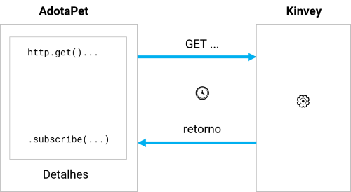

# Versão 7

> Você pode acompanhar o código completo dessa versão acessando https://play.nativescript.org/?template=play-ng&id=4zfO6B&v=9

Nesta versão vamos implementar o requisito não-funcional:

* as informações sobre os animais disponíveis para adoção devem ser obtidas de uma fonte externa (API HTTP ou BaaS)

## Kinvey

O [Kinvey](https://www.progress.com/kinvey) é um serviço fornecido pela *Progress*, a mesma empresa que desenvolve o NativeScript. Ele é um banco de dados fornecido como um serviço, utilizando o conceito de *Backend as a Service* (daí o **BaaS**). Isso significa que podemos utilizar uma parte de um software na nuvem, por exemplo, para armazenar dados.

Essa é uma alternativa muito interessante ao uso de bancos de dados relacionais em infraestrutura própria.

Além disso o Kinvey fornece acesso aos seus recursos por meio de uma API HTTP REST. Assim, para que um app consiga acessar os dados (seja para leitura ou gravação), considerando que há um recurso disponível por meio do Kinvey, é necessário utilizar recursos do HTTP.

## Usando o serviço HttpClient

O `HttpClient` é um serviço que permite acessar recursos via HTTP.

Para implementar o requisito dessa versão vamos começar modificando o `HomeRoutingModule`. Adicione a importação:

```typescript
import { NativeScriptHttpClientModule } from "nativescript-angular/http-client";
```

Adicione esse módulo à lista de importações:

```typescript
@NgModule({
    imports: [
        NativeScriptHttpClientModule,
...
    ],
...
})
export class HomeModule { }
```

Isso fará com que o serviço `HttpClient` esteja disponível para os componentes do módulo.

Na sequência vamos modificar um pouco a estrutura do software. Na [versão 6](adotapet-v6.md) o serviço `AnimaisService` está na pasta `app/home`. Vamos criar a pasta `app/shared` e mover o `app/home/animais.service.ts` para ela.

Precisamos de um arquivo de configuração para acessar o Kinvey (veja o arquivo `app/shared/config.ts`) e um arquivo que declara a classe `Animal` (`app/shared/animal.model.ts`).

Na sequência, alteramos o `AnimaisService` para injetar o `HttpClient` e acessar a API. Como o código do serviço fica muito extenso para mostrar aqui, vou demonstrar apenas o conteúdo do método `lista()`. Veja como muda:

```typescript
lista() {
    // ordernar os resultados pela data de modificação de forma decrescente
    let params = {
        "sort": "{\"_kmd.lmt\": 1}"
    }
    const headers = {
        headers: this.getCommonHeaders(),
        params: params
    };

    return this.http.get(this.baseUrl, headers)
        .pipe(
            map((data: []) => {
                let lista = [];
                data.forEach((animal: any) => {
                    lista.push(new Animal(
                        animal._id,
                        animal.nome,
                        animal.foto,
                        animal.especie,
                        animal.cidade,
                        animal.estado,
                        animal.sexo,
                        animal.porte
                    ));
                });
                return lista;
            }),
            catchError(this.handleErrors)
        );
}
```

A classe tem:

* o atributo `baseUrl`, que indica a URL da API para acessar os dados no Kinvey
* o método `getCommonHeaders()`, que auxilia na definição dos cabeçalhos HTTP que devem ser enviados na requisição para o Kinvey
* o método `handleErrors()`, que é usado para tratamento de erros do HTTP

O código do método `lista()` faz o seguinte:

* define parâmetros enviados para o Kinvey para ordenar os dados pela data de modificação, de forma decrescente
* define os cabeçalhos que serão enviados na requisição HTTP (isso é necessário por questões de autorização -- por isso a necessidade do arquivo `app/shared/config.ts`)
* usa o método `get()` para fazer uma requisição HTTP `GET`. O restante do código envolvido (usando `pipe()` e `map()` utiliza operadores `rxjs` para transformar o `Observable`, resultado do retorno do método `get()` e retornar um array de objetos conforme o model `Animal`)

## Usando a nova implementação do `AnimaisService` no `ListaComponent`

Para usar a versão atual do `AnimaisService` precisamos fazer algumas pequenas alterações no componente `ListaComponent`. Primeiro, substituindo o método `ngOnInit()` por:

```typescript
ngOnInit(): void {
    this.animais = this.db.lista();
}
```

Quando esse método for executado o atributo `animais` será um `Observable` e não podemos acessar os dados contidos nele diretamente. Por isso, precisamos alterar a tag de abertura do `ListView` para:

```html
<ListView class="list-group" [items]="animais | async" ...>
```

Atenção para `[items]="animais | async"`. Anteriormente, quando `animais` era um array, bastava usar `[items]="animais"`. Agora, precisamos usar o recurso do Angular chamado **pipe** para transformar `animais` em algo que o template possa realmente utilizar. Nesse caso, o pipe `async` transforma um `Observable` (o tipo de `animais` no momento) em um array. 

Outra alteração tem relação com a interação com o usuário. Na versão anterior, tínhamos um tratador do evento `itemTap` (`(itemTap)="onItemTap($event)"`), mas agora precisamos dos dados do animal associado ao item para navegar para a tela `DetalhesComponent` e obter mais informações dele. Por isso, retiramos o tratador do evento do `ListView` e adicionamos o evento `tap` no `GridLayout`. Ficando assim:

```html
...
<ListView class="list-group" [items]="animais | async"
    style="height:1250px">
    <ng-template let-animal="item">
        <GridLayout columns="60, *" class="list-group-item"
            (tap)="onItemTap(animal)">
...
        </GridLayout>
    </ng-template>
</ListView>
...
```

Veja que agora passamos o objeto `animal` para o método `onItemTap()` que é alterado para o seguinte:

```typescript
onItemTap(animal): void {
    this.router.navigate(['/', 'home', 'detalhes', animal.id]);
}
```

## Modificação no `DetalhesComponent`

Precisamos modificar o `DetalhesComponent` para usar a versão atual do `AnimaisService`. Começamos alterando o método `ngOnInit()`:

```typescript
ngOnInit(): void {
    let id = this.route.snapshot.paramMap.get('id');
    this.db.animal(id).subscribe(dados => this.animal = dados);
}
```

O código obtém o valor do parâmetro de rota `id`, mas sem alterar seu tipo (mantém o tipo `string`). Na sequência, usa o método `animal()` do `AnimaisService`, que recebe como parâmetro o identificador do animal, faz uma requisição à API do Kinvey e retorna um `Observable` com os dados do animal. 

Outra forma de ter acesso aos dados do `Observable` está sendo utilizada aqui: o método `subscribe()`. O parâmetro para o método é uma **função seta** (*arrow function*) que tem o parâmetro `dados` e o atribui seu valor para o atributo `animal` do controller.

A próxima alteração é no template. Por causa do uso do `HttpClient` e do tipo `Observable` estamos lidando com um formato chamado de **requisição assíncrona**. Significa que quando a tela `DetalhesComponent` for aberta, embora o código já tenha o identificador do animal que precisa ser consultado, os dados do animal em questão não estão disponíveis imediatamente, porque será feita uma requisição HTTP e o retorno pode demorar alguns instantes. Por isso, precisamos aplicar a diretiva `*ngIf` ao `GridLayout`:

```html
<GridLayout rows="auto, 200, auto, auto" *ngIf="animal">
...
</GridLayout>
```

Ou seja, o `GridLayout` só estará visível se o atributo `animal` tiver um valor diferente de `null`.

A figura a seguir ajuda a ilustrar o que nesse processo.



Ao lidar com requisições assíncronas estamos usando uma característica bastante frequente de código moderno: executar um código quando um retorno acontece. Por isso as **arrow functions** também são chamadas de **callbacks**.
