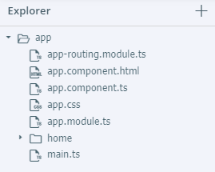

# Estrutura do projeto

O Playground mostra, do lado esquerdo, o painel *Explorer*, que apresenta a estrutura do projeto. 

Neste momento o *hello world* contém os arquivos dentro da pasta *app*:

* `main.ts` é o arquivo principal do projeto e determina um ponto de partida da execução
* `app.module.ts` representa o **módulo raiz** (todo projeto Angular tem pelo menos um módulo)
* `app.css` representa o arquivo CSS com os estilos globais, que podem ser aplicados em todo o projeto
* `app-routing.module.ts` representa o **módulo de rotas raiz** e é utilizado para determinar a navegação do aplicativo
* `app.component.ts` e `app.component.html` compõem o componente `App`

Os arquivos dentro da pasta `app/home` representam o módulo `Home`, que contém:

* `home.module.ts` o módulo
* `home-routing.module.ts` o módulo de rotas
* `home.component.ts`, `home.component.html` e `home.component.css` compõem o componente `Home`

Arquivos com extensão `ts` são TypeScript.

Os elementos **módulo**, **módulo de rotas** e **componente** fazem parte da arquitetura do Angular e estão no projeto porque é assim que esse framework determina. 

No caso dos componentes, eles são compostos por:

* **controller**: representado por uma classe TypeScript
* **template**: representado pelo arquivo HTML
* **estilo**: representado pelo arquivo CSS

Esses elementos fazem parte da arquitetura **MVC** (Model-View-Controller) que separa responsabilidades para cada parte do software:

* o **controller** é responsável pela lógica, pela execução do componente (está no arquivo TypeScript)
* a **view** é responsável pela interface gráfica (é representada pelos arquivos HTML e CSS)
* o **model** representa um mecanismo de intercâmbio de informações entre controller e view (como é um conceito, não tem um arquivo específico)

## Módulo

O módulo representa uma forma de compartimentar os elementos do software. Um módulo pode conter componentes. Um módulo pode importar outro módulo. 

O módulo raiz `app/app.module.ts` contém a classe `AppModule`, que é *anotada* com `NgModule` (de forma a identificar que ela representa um módulo do Angular).

O módulo define:

* o componente de início (atributo `bootstrap`)
* as importações (atributo `imports`) (o módulo raiz importa o módulo de rotas)
* as declarações, ou quais componentes fazem parte desse módulo (atributo `declarations`)

## Módulo de rotas

O módulo de rotas, como o nome indica, também é um módulo. A diferença para o anterior é que ele é mais simples. Também usa a anotação `NgModule`, mas define apenas duas informações:

* as importações (atributo `imports`)
* e as exportações (atributo `exports`)

Ambos os atributos fazem referência às rotas definidas em `routes` (mais sobre isso depois). 

## Componente

Como já indicado, o componente é geralmente representado por três arquivos. No caso do componente `App`, declarado em `app/app.component.ts`, ele contém a classe `AppComponent`, que é *anotada* com `Component`. A declaração indica duas informações:

* o seletor (atributo `selector`)
* a URL do template (atributo `templateUrl`)

No caso do componente `HomeComponent`, definido em `app/home/home.component.ts`, temos:

* o seletor
* a URL do template
* a URL do estilo

