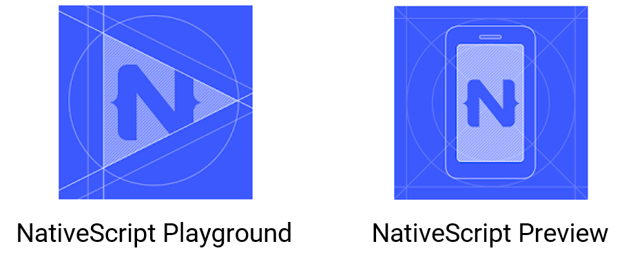
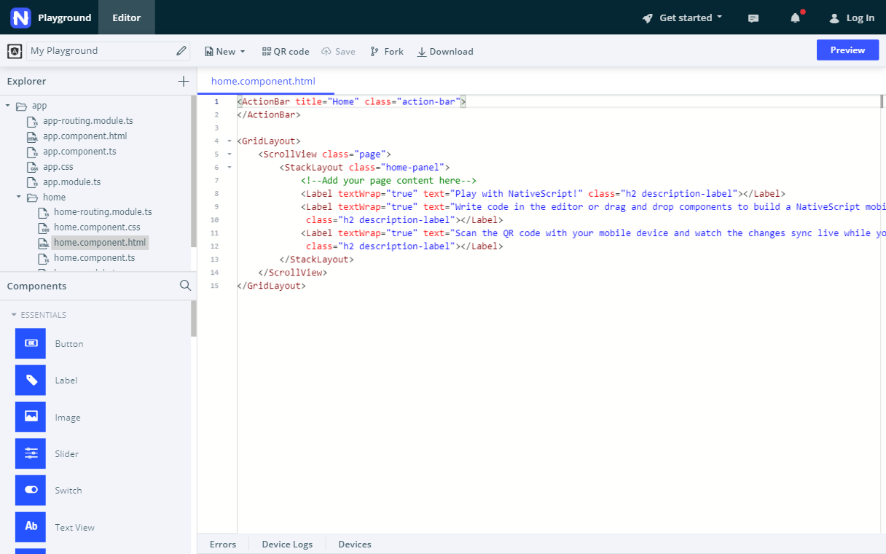
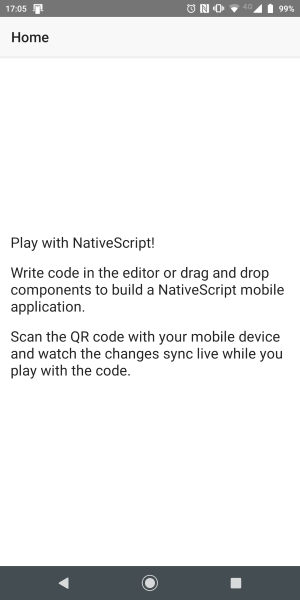
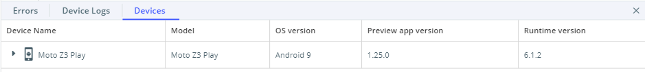

# Hora de brincar!

Instale o *Playground* e o *Preview* no seu dispositivo. Seus ícones são semelhantes ao que ilustra a figura a seguir.

Acesse o [Playground](https://play.nativescript.org/) utilizando seu browser de preferência. Quando fizer isso, ele já carrega um projeto no template NativeScript+Angular.

Pressione *Preview*. Quando o código QR aparecer, abra o *Playground* no seu dispositivo e pressione *Scan*. O dispositivo vai ser conectado ao browser e o *Preview* vai ser executado para mostrar o seu app.

De volta ao *Playground*, um painel mostra a aba *Devices*, que lista o dispositivo conectado (é possível ter mais de um dispositivo conectado).

O mesmo painel fornece as abas *Errors* (para exibição de erros de execução) e *Device Logs*.

## Atualização do app em tempo real

O arquivo `home.component.html` está aberto no editor, certo? Então, faça o seguinte:

1. na linha 8 há um elemento `Label`. Modifique o atributo `text` dele para `NativeScript Playground`
2. apague as linhas 9 a 12
3. pressione *Preview* (ou <kbd>CTRL</kbd> + <kbd>S</kbd>)

Volte ao seu dispositivo e veja o resultado. Impressionante, não? Eu curto demais :heart_eyes:

